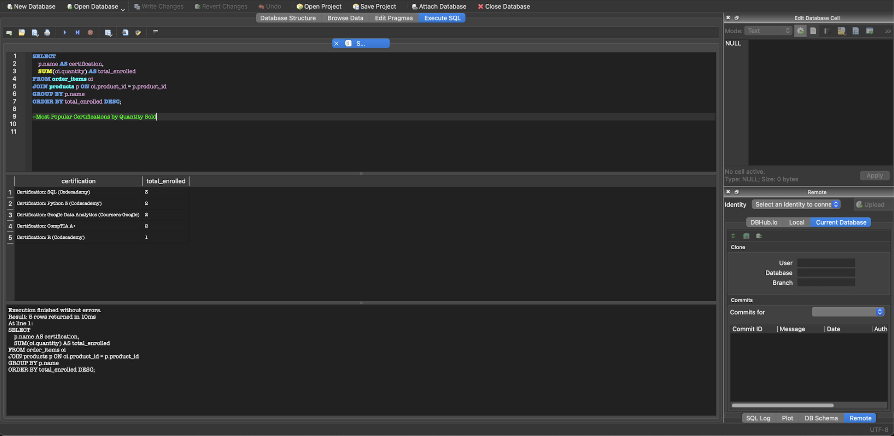
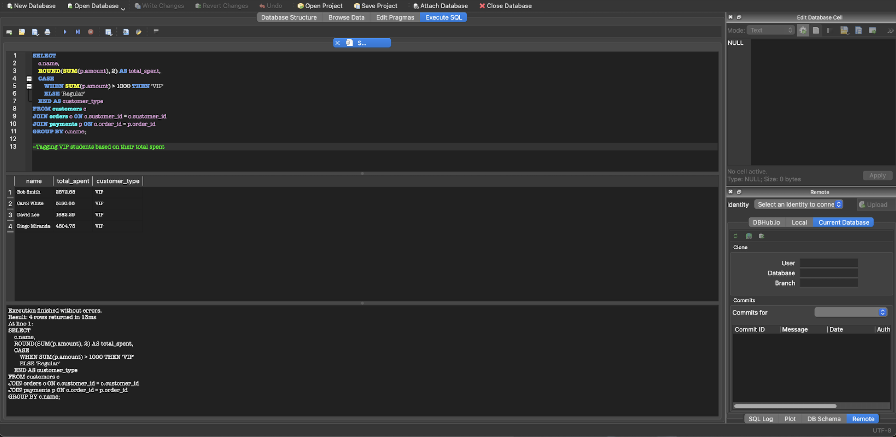
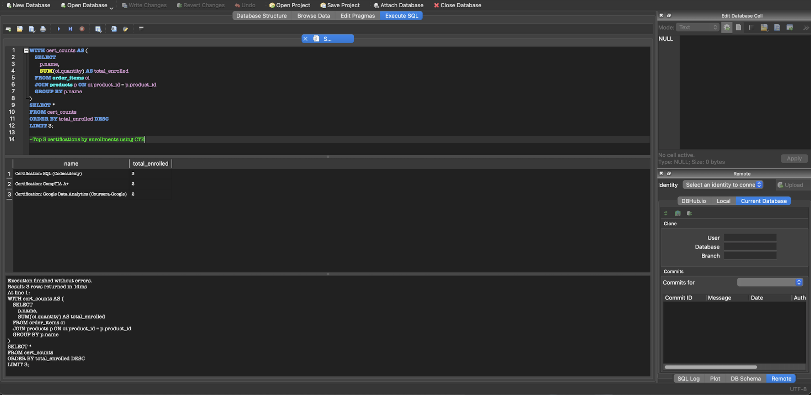
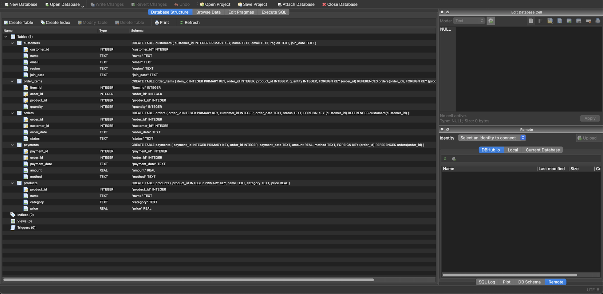
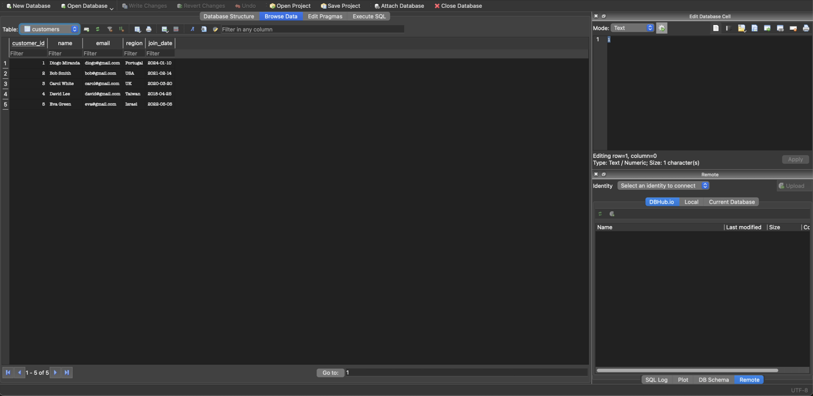

---

## SQL Query Results & Data Snapshots

### Most Popular Certifications by Enrollment

Uses `JOIN`, `GROUP BY`, and `ORDER BY` to find the most enrolled certifications.

### Monthly Revenue Trend

Aggregates monthly revenue using `strftime()` and `SUM()` for business trend reporting.

### Tagging VIP Students Based on Total Spend

Uses a `CASE` statement to tag customers as VIPs based on their lifetime spend.

### Customers Who Spent Above Average

A `HAVING` clause with a subquery identifies above-average spenders.

### Top 3 Certifications by Enrollments (Using CTE)

Uses a Common Table Expression (CTE) to extract and sort enrollments by popularity.

### Database Structure

ERD-like view showing normalised tables and foreign key relationships.

### Sample Customers Table

Personalized user data simulates a realistic customer base for analysis.
